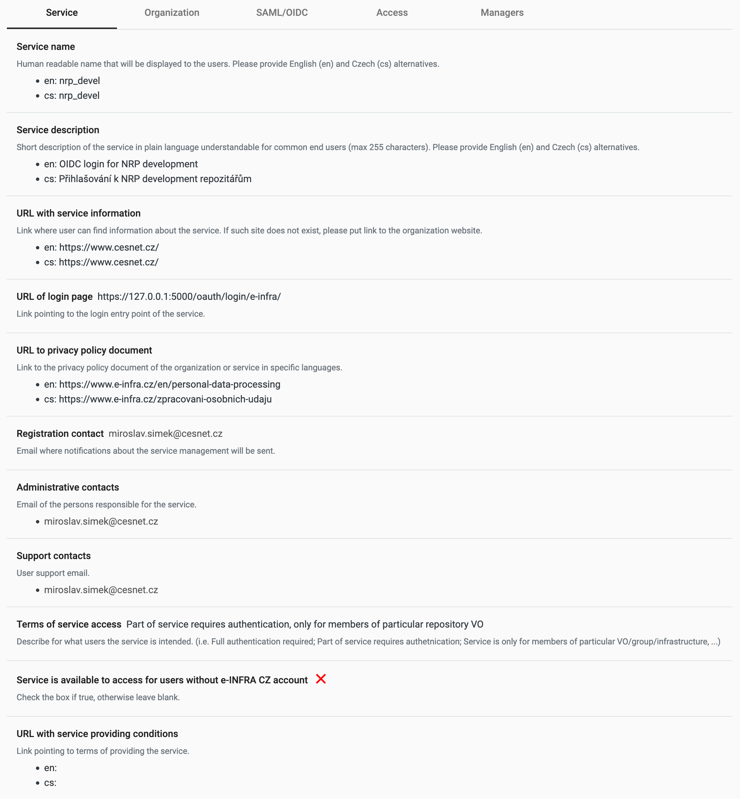
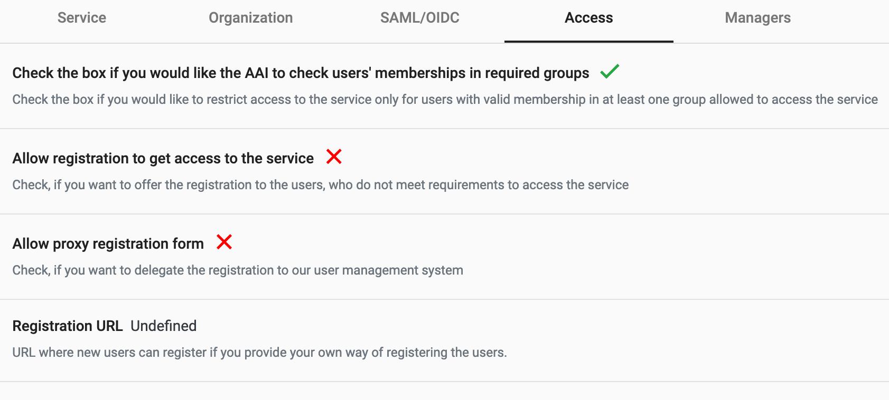

# E-infra authentication and authorization module for InvenioRDM

This remote backend adds support for Czech e-infra AAI solution - login.e-infra.cz
allowing all members of czech academic community can use their home institution
credentials to log in.

## Installation

Add the module to your repository's pyproject.toml:

``` toml

dependencies = [
    "oarepo-oidc-einfra>=1.0.0",
    # ...
]
```

## Configuration

1. Register a new application with e-infra OIDC Provider at
   https://spadmin.e-infra.cz/. When registering the application
   ensure that the *Redirect URI* points to `https://<my_invenio_site>:5000/oauth/authorized/e-infra/`





In OIDC parameters, you need to set at least the following scopes:
- openid
- profile
- email
- eduperson_entitlement
- isCesnetEligibleLastSeen
- organization





2. Grab the *Client ID* and *Client Secret* after registering the application
   and add them to your ENVIRONMENT variables:
```python
INVENIO_EINFRA_CONSUMER_KEY=*Client ID*
INVENIO_EINFRA_CONSUMER_SECRET=*Client Secret*
```
3. Add the remote application to the site's `invenio.cfg`:

```python
from oarepo_oidc_einfra import EINFRA_LOGIN_APP

OAUTHCLIENT_REMOTE_APPS = {
    "e-infra": EINFRA_LOGIN_APP
}
```

4. Add the e-infra public key to your invenio.cfg or environment variables:
```python
EINFRA_RSA_KEY=b'-----BEGIN PUBLIC KEY-----\nMIIBIjANBgkqhkiG9w0BAQEFAAOCAQ8AMIIBCgKCAQEAmho5h/lz6USUUazQaVT3\nPHloIk/Ljs2vZl/RAaitkXDx6aqpl1kGpS44eYJOaer4oWc6/QNaMtynvlSlnkuW\nrG765adNKT9sgAWSrPb81xkojsQabrSNv4nIOWUQi0Tjh0WxXQmbV+bMxkVaElhd\nHNFzUfHv+XqI8Hkc82mIGtyeMQn+VAuZbYkVXnjyCwwa9RmPOSH+O4N4epDXKk1V\nK9dUxf/rEYbjMNZGDva30do0mrBkU8W3O1mDVJSSgHn4ejKdGNYMm0JKPAgCWyPW\nJDoL092ctPCFlUMBBZ/OP3omvgnw0GaWZXxqSqaSvxFJkqCHqLMwpxmWTTAgEvAb\nnwIDAQAB\n-----END PUBLIC KEY-----\n'
```

5. Add the VO, communities group, api url and others to your invenio.cfg or environment variables:

```python

EINFRA_SERVICE_USERNAME = "username"
"""Username of the service in the E-INFRA Perun."""

EINFRA_SERVICE_PASSWORD = "password"
"""Password of the service in the E-INFRA Perun."""

EINFRA_SERVICE_ID = 0
"""Internal ID of the service (whose username and password are above) in the E-INFRA Perun."""

EINFRA_REPOSITORY_VO_ID = 0
"""Internal ID of the VO in the E-INFRA Perun that represents the repository."""

EINFRA_COMMUNITIES_GROUP_ID = 0
"""Internal ID of the group in the E-INFRA Perun that represents the communities."""

EINFRA_REPOSITORY_FACILITY_ID = 0
"""Internal ID of the facility in the E-INFRA Perun that represents the repository."""

EINFRA_CAPABILITIES_ATTRIBUTE_ID = 0
"""Internal ID of the attribute in the E-INFRA Perun that represents the capabilities."""

EINFRA_SYNC_SERVICE_ID = 0
"""Internal ID of the service in the E-INFRA Perun that is responsible for synchronization
(creating and pushing dumps with resources and users)."""

```

6. Start the server and go to the login page https://127.0.0.1:5000/login/
